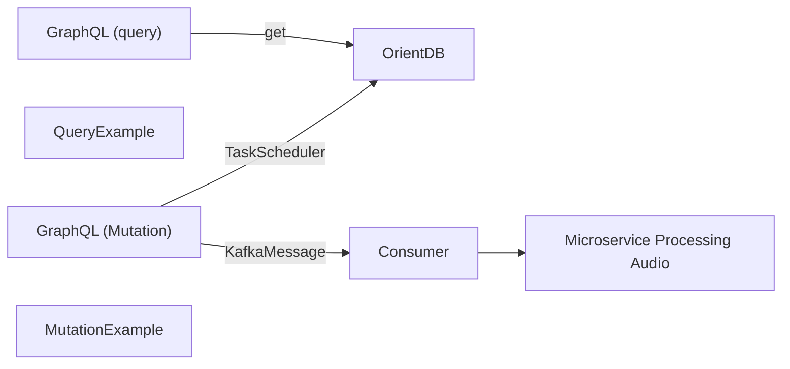

# Explore
[GraphQL](https://graphql.org/) API built with [Flask](https://graphql.org/), [Graphene](https://graphene-python.org/) and Python 3.8.10

## Sequence diagram

## Pre- requirements
-  Python 3.9
-  Pip 3
-  venv
-  Docker
## Installation
After cloning the project create a virtual environment and activate it:
```bash
    $ python3 -m venv venv
    $ source venv/bin/activate
```
Install dependencies from _requirements.txt_:
```bash
    (venv) $ pip3 install -r requirements.txt
```
## Run
```bash
    $ python3 app.py
```
To test the application, access http://localhost:5000/graphql
# Build the app
```
gcloud builds submit --tag gcr.io/speech-analysis-256223/explore-image .
```
```
kubectl apply -f explore-config.yaml
kubectl apply -f deployment.yaml
kubectl apply -f service.yaml
```
